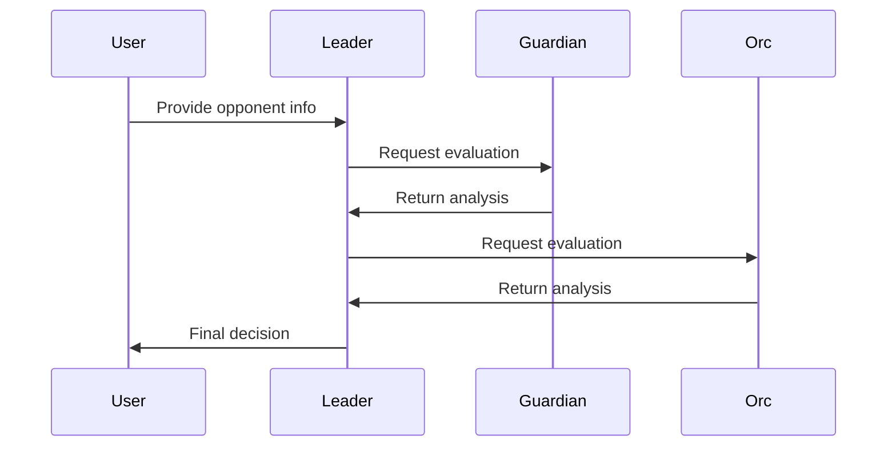

# AI Game - Multi-Agent Role-Playing System 🎮

This project implements a multi-agent role-playing system where different AI agents interact with each other to evaluate and respond to potential opponents in a fantasy setting.

## Overview


The system consists of three main agents:
- **Leader** 👑: The main decision-maker who coordinates with other agents
- **Guardian** 🛡️: A protective agent who evaluates threats and makes jokes about mages
- **Orc** 🪓: A straightforward agent who typically prefers aggressive actions

## Features

- 🤖 Multi-agent interaction system
- 🎭 Role-based decision making
- 🧠 Context-aware responses
- 🔥 Firebase integration for output storage
- ⚡ OpenAI GPT-4 integration

## Project Structure

```
agents_core/
├── main.py           # Main application logic and agent orchestration
├── models.py         # Pydantic models for agent outputs
└── contex_agents.py  # Agent context and instructions
```

## Quick Start 🚀

1. Clone the repository
   ```bash
   git clone https://github.com/yourusername/ai_game.git
   cd ai_game
   ```

2. Install dependencies:
   ```bash
   pip install -r requirements.txt
   ```

3. Set up your environment:
   ```bash
   # Create .env file
   echo "OPENAI_API_KEY=your_api_key_here" > .env
   ```

4. Run the example:
   ```bash
   python -m agents_core.main
   ```

## Interactive Demo 🎮

Try running the system with different opponents:

```python
context = PersonContext(
    name="Krogan Iron Fist",
    age=35,
    skills=["Two-handed sword mastery", "Battle rage"],
    background="A legendary warrior from the northern tribes",
    magical_affinity="None"
)
```

## Agent Decision Flow



## Agent Roles

### Leader 👑
- Main decision-maker
- Coordinates with other agents
- Makes final decisions based on collective input

### Guardian 🛡️
- Evaluates threats
- Makes jokes about mages
- Respects barbarians and fighters
- Decides to help only if opponent is clearly stronger

### Orc 🪓
- Simple decision-making
- Typically prefers aggressive actions
- Responds in orc language

## Example Output

```json
{
    "attack": true,
    "reason": "The opponent poses a significant threat to our territory",
}
```

## Requirements

- Python 3.8+
- OpenAI API key
- Firebase setup (for output storage)

## Contributing 🤝

Feel free to contribute to the project! Here's how:

1. Fork the repository
2. Create your feature branch (`git checkout -b feature/AmazingFeature`)
3. Commit your changes (`git commit -m 'Add some AmazingFeature'`)
4. Push to the branch (`git push origin feature/AmazingFeature`)
5. Open a Pull Request

## License

[Add your license information here] 